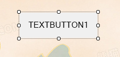

# MVPControls
为MVPFramework提供一些winform平台下的组件。当然，不使用MVPFramework，也可以使用这些组件。

## 组件列表
|       组件       |  编译状态   | 发布状态|
| --------------- | ------- |-------|
| MForm | success |已发布|
| MTextButton | success | 已发布|
| MLabel | success | 已发布|
| MClickableLabel | success | 已发布|

### 组件展示
#### MVPForm


#### TextButton


### Getting Started
Nuget:
```
Install-Package MVPControls -Version 2020.10.1
```

github  
1. clone 项目
```
git clone git@github.com:MVPFramework/MVPFramework_Controls.git
```
2. 编译项目，获取DLL引用即可


git filter-branch -f --prune-empty --index-filter 'git rm -rf --cached --ignore-unmatch other/TT.7z' --tag-name-filter cat -- --all
<file.src>为该文件路径

